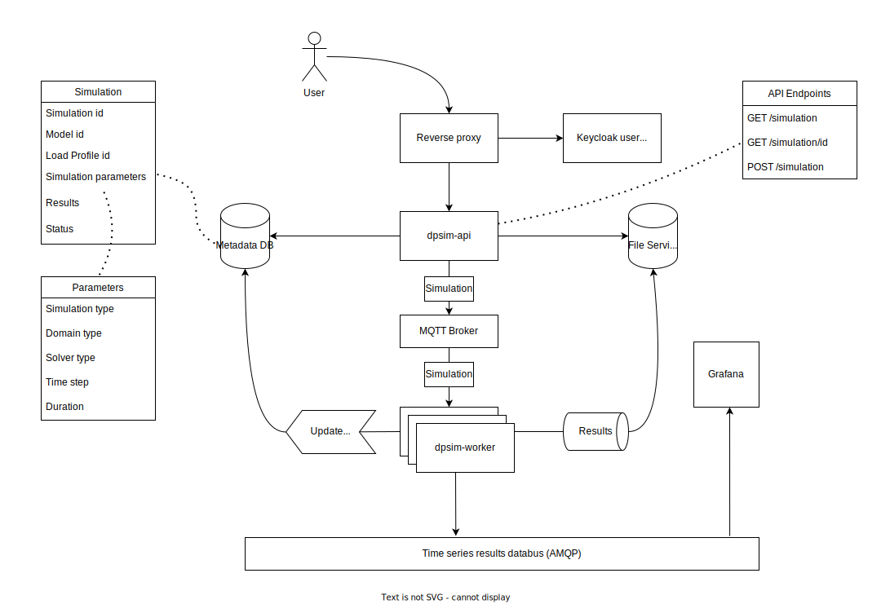

# Rest API for DPsim

### This is a work in progress. A working prototype can be run using
[the example deployments project](https://github.com/sogno-platform/example-deployments).

### Read [the api specification](http://sogno.energy/docs/api-specifications/simulator-api)

### Architecture diagram



### Start the rest service manually

```bash
cargo run
```

This will compile and run the API Server.

### Run the tests manually

```bash
cargo test
```

### Generate the documentation

```bash
cargo doc --no-deps
```

### Install using helm 
```bash
helm install dpsim-api helm/ --values helm/values.yaml
```
